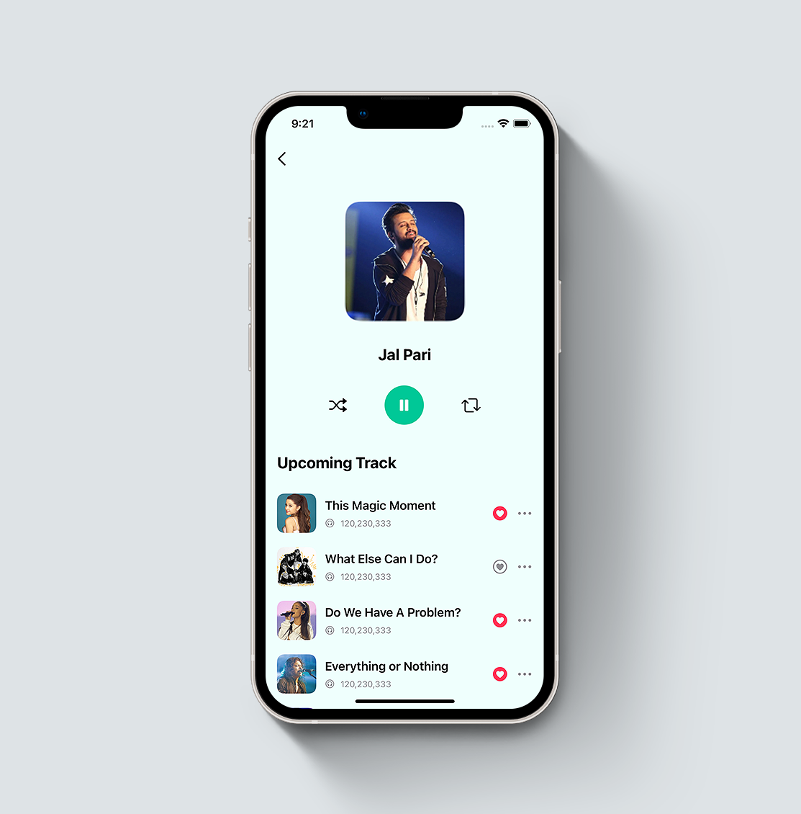

# Minimal Podcast App UI

Animated Minimal Podcast App UI using SwiftUi 3.0 🤓

A music streaming service is a type of streaming media service that focuses primarily on music, and sometimes other forms of digital audio content such as podcasts. These services are usually subscription-based services allowing users to stream digital copyright restricted songs on-demand from a centralized library provided by the service. Some services may offer free tiers with limitations, such as advertising and limits on use. They typically incorporate a recommendation engine to help users discover other songs they may enjoy based on their listening history and other factors, as well as the ability to create and share public playlists with other users.

## Screenshots

